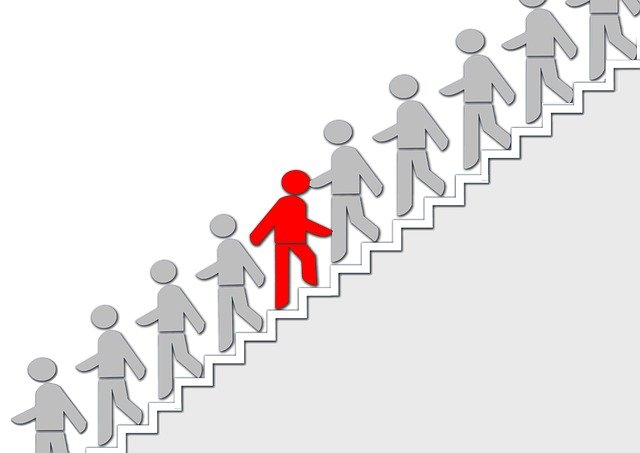

Upon more investigation I found this quote from Dave Ramsey was more than three years old..

but I only heard it this week.

and I like it.

It's a quite succinct way for encapsulating the bigger message which is that millions of people in the western world are cruising on auto-pilot towards inadequate pensions and working long into their 70s or 80s.

The world is set up for you to spend all your money on stuff which provides little true happiness.

I don’t want this post to turn into one of those giving people grief about their weekday Caramel Macchiato because quite frankly I’ve worked in soul-crushing jobs where those kind of things are the highlight of your day and in the big picture they aren’t really making a dent.

If I could have any positive influence on this world I’d love it to be that I’d helped increase financial literacy by demolishing the taboo of talking about money.

But let’s be real...

The majority of people we hang out with don’t want to talk about asset allocation, inflation and mortgage interest rates.

So that makes you the weirdo, I’m afraid.

### Positive steps

Getting yourself into a circle of people who want to talk about these things is crucial for your mental health.

Local property, business networking or FIRE meetups are a great place to start. Since the pandemic lots of these things have moved to Zoom which makes it even easier. But dig them out wherever your little corner of the planet is.

_So what, I’m just gona ditch my friends and partner to spend the evening talking randos through my early retirement dreams?!??_

Yep. And you’ll thank me for cyber-bullying you into it.

You know deep down following the lead of society isn’t going to get you to your goals.

Because you’re the weirdo. And we’re owning it.

