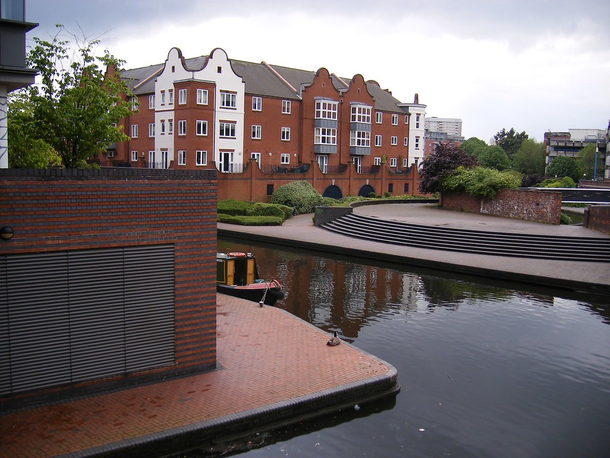

Lots of people will tell you why one is unequivocally better than the other — but the real answer surely depends on your strategy.

Do you hate the idea of having a management company charge you a random fee to ‘maintain’ the ground of a flat complex? Maybe you should stick to houses.

Are you focused on rock solid professional tenant demand? If so you’re not going to find a huge amount of houses smack bang in the city centre of Manchester.

If you excel at reconfiguring and refurbishing then you’re almost certainly going to be looking at houses.

### Why people are scared of flats

Because of the UK’s concept of leasehold, flats come with ground rents and service changes which, depending on how much of a scumbag the original builder was — can be anything from almost unnoticeable to a total deal breaker.

At the time of writing I own 2 flats both of which have a month GR + SC of less than £70 — this helps maintain the entire complex — covers the insurance for the whole building and keeps the lifts + communal lights working. Maybe these numbers could be lower — but saving £10/£15 pm here wont make a material difference to my business.

### Why people are scared of houses

I don’t know many investors who straight-up avoid houses, but the people I know who favour flats are generally the more ‘hands off’ investors. This means they want to minimise the things that can go wrong in their properties. And although there’s always exceptions, generally a flat will need less work than a house for obvious reasons.

### Much of it comes down to demographic

Who are your target audience? Where do they want to live? Generally this should dictate what type of property you’re considering. If you’re creating a 6-bed student house — you want to be near either campus or nightlife — preferably both!

If you’re trying to attract middle-class young professional tenants — most of these will want to live in the city centre. 9/10 properties will be flats so you’ll be backing yourself into a corner trying to find a house.

### Think about your time/skills

Depending what you’re bringing to a project, this may lead your decision also. If you’re a builder who specialises in loft conversions — you can probably add more value to an out of town family home than you can to a city centre flat. This might mean getting a much better return on investment in the long run.

On the other hand, if you’re a super-busy banker ‘in the city’ — maybe paying £75 per month into a central pot to both organise and pay for maintenance is a dream come true for you. After all, you want to focus on selling those contracts or whatever.

### It all comes back to numbers

It’s pretty simple in the end: it’s all about the numbers. Your fixed overheads are often higher on a flat but your variable maintenance costs are often less. But as long as there’s a line on your spreadsheet for each then you can make sensible calculations.

Any investment is designed to serve a purpose. That purpose is often financial, but should equally (and maybe more importantly) be about building yourself the lifestyle you want. And at the end of the day the only person who can really answer that question is you.
