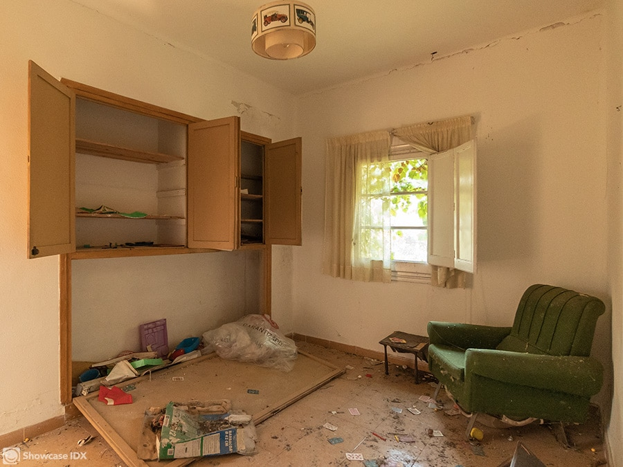
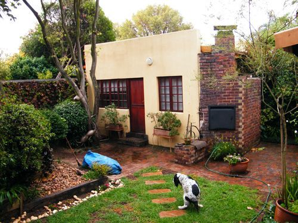

Picture this..

It’s coming to the end of month eight of that project you swore would be turned around and on the market in 6 weeks.

You’ve smashed through your 10–15% contingency and the flooring guy who promised he’d get the carpets done last week has finally rocked up to get the job done.

The idea that the project could literally cost you any more money is offensive to your brain but the prospect is as real as it comes.

But after a few finishing touches, you’re eventually done. It’s ready.

Bloody hell.

### Time to get this bad girl on the market.

Whip around and take some photos on your phone and then we’re away.

Rightmove here we fricking come.

Take the photos, mark the occasion. Get them on your instagram stories and revel in a job well done.

But you’re not done yet.

There’s a very strong chance your photos are anywhere from a bit to incredibly shit.

Yes your shots will do the job and you might think the refurb will sell itself.

But _why why why_ after all that work would you leave this, the most important part, to chance.

When your prospective tenant is eagerly scrolling through Rightmove you’ve literally got a 2-inch window in which you can make an impression.

Whether you’re selling or renting you want to be catching as many eyes as possible to give your property the best chance of finding the best quality buyer or tenant sharpish.

You’ve put in all that work on the refurb, finish the job properly by paying a professional to photograph your glorious creation.

Correctly lighting multiple rooms in a house is a complicated process that (with the greatest respect) more than likely you have no idea how to do properly.

### A few hundred quid at most. That’s all it takes.

If you’re flipping, you want someone to fall in love with it. If you’re renting you’ve got the photos for life and you can reuse them in the future.

Not to mention being able to plaster those pro photos all over social media, if you’re that way inclined.

Every property I’ve ever bought or rented I spent barely 15 minutes walking around it, but spent HOURS starring at the floorplans and more importantly the god-damn photos.

If your property can sell for even £500 more, it was worth it.

If you property can tempt a tenant in quickly instead of within a few weeks, it was worth it.

If you can start a bidding war, then it was more than worth it.

I’m wildly frugal in so many things in life but this is one cost where the return on investment is an absolute no-brainer.

If you were going on Dragons Den with the task of pitching a rainbow, would you pay a bit extra for the colour tv? I hope so.

